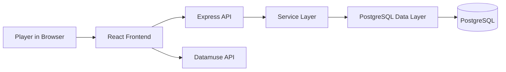

# Relay Project Documentation

Relay is a browser-based word-chain game built with a Node.js/Express backend and a React + Vite frontend. The gameplay loop is simple: the game provides a starting fragment, the player types a valid English word beginning with that fragment, and the last two letters of the submitted word become the next required fragment. A round ends when the player submits a word that is not valid or cannot chain further.

This project combines:

- A React frontend for UI, keyboard input, menu screens, score tracking, and leaderboard display.
- An Express REST API for leaderboard and score persistence.
- PostgreSQL as the data store for users and scores.
- External word validation via the Datamuse API.

---

## 1. Project Overview

Relay is a word game inspired by chain-word mechanics. The player keeps producing valid words that continue the chain. The score increases with each accepted word, and the most successful runs are stored in a leaderboard.

### Core game rules

1. A random starting fragment is generated, such as RO.
2. The player types a word that starts with that fragment.
3. The word must be a real word and must be chainable.
4. The last two letters of the accepted word become the next fragment.
5. The player repeatedly continues the chain.
6. If a word is invalid, already used, too short, or cannot chain to another word, the game ends.

### Example flow

- Starting fragment: RO
- Player enters: ROCK
- ROCK starts with RO
- Last two letters are CK
- Next fragment becomes CK
- Player enters: KING
- KING starts with CK? No, so it fails and the game ends

In the actual implementation, the valid word check is handled by Datamuse and the chainability check looks for words whose last two letters are valid to continue the pattern.

---

## 2. Architecture Summary

This project uses a classic three-layer backend design and a component-driven frontend.



### Frontend responsibilities

- Renders the game board, menu screens, score, keyboard, word list, and overlay states.
- Validates user input locally and through Datamuse APIs.
- Sends score submissions to the backend.
- Displays leaderboard data fetched from the API.

### Backend responsibilities

- Exposes REST endpoints for scores and users.
- Validates request payloads.
- Applies service-layer business rules.
- Saves score records and reads leaderboard data from PostgreSQL.

---

## 3. Tech Stack

### Frontend

- React 19
- Vite
- JavaScript / JSX
- CSS-in-JS via inline style objects in component files

### Backend

- Node.js
- Express 5
- PostgreSQL client (pg)
- Jest for tests
- dotenv for environment-based config
- CORS for browser access

### External services

- Datamuse API for word validation and chainability checks

---

## 4. Repository Structure

```text
relay/
├── README.md
├── backend/
│   ├── index.js                 # Express app entry point
│   ├── package.json             # Backend dependencies and scripts
│   ├── .env                     # Local environment variables
│   ├── seed.js                  # Inserts sample score data
│   ├── controller/
│   │   ├── scoresController.js
│   │   └── usersController.js
│   ├── data/
│   │   ├── db.js                # PostgreSQL connection config
│   │   ├── scores.js            # Score database queries
│   │   └── users.js             # User database queries
│   ├── routes/
│   │   ├── scoresRoutes.js
│   │   └── usersRoutes.js
│   ├── service/
│   │   ├── scoresService.js
│   │   └── usersService.js
│   ├── sql/
│   │   ├── tables.sql
│   │   └── seeding.sql
│   └── test/
│       ├── testConnection.js
│       ├── users.test.js
│       └── usersService.test.js
├── frontend/
│   ├── game.html               # Standalone HTML prototype
│   └── relay/
│       ├── package.json
│       ├── vite.config.js
│       ├── eslint.config.js
│       ├── index.html
│       └── src/
│           ├── App.jsx
│           ├── main.jsx
│           ├── api/
│           │   ├── dictionaryapi.js
│           │   └── scoresapi.js
│           ├── components/
│           │   └── relay-game/
│           │       ├── index.jsx
│           │       ├── Menu.jsx
│           │       ├── Leaderboard.jsx
│           │       ├── Keyboard.jsx
│           │       ├── WordBank.jsx
│           │       ├── UsedWords.jsx
│           │       ├── GameOver.jsx
│           │       ├── LoadingScreen.jsx
│           │       ├── Toast.jsx
│           │       ├── Chainpill.jsx
│           │       ├── Connecter.jsx
│           │       ├── ComponentStyles.jsx
│           │       ├── Fragments.js
│           │       ├── Menuicon.jsx
│           │       └── ...
│           └── Util/
│               └── Utils.jsx
└── server/
```

---

## 5. Backend Design

### Entry point

The backend starts in [backend/index.js](backend/index.js). It configures:

- Express
- CORS
- JSON body parsing
- Route mounting for `/users` and `/scores`
- Root health check route `/`

```js
app.use(cors());
app.use(express.json());
app.use('/users', usersRoutes);
app.use('/scores', scoresRoutes);
```

### Route structure

#### User authentication routes

Mounted under `/users`.

- `POST /users/register` - create a user and issue a verification code
- `POST /users/resend-code` - generate a new verification code
- `POST /users/verify` - verify the code and issue an auth token
- `POST /users/logout` - clear auth token
- `GET /users/profile` - fetch user profile
- `PATCH /users/profile` - update username fields

These routes are backed by the service layer in `usersService.js` and the data access layer in `users.js`.

#### Score routes

Mounted under `/scores`.

- `POST /scores/submit` - insert a completed game score
- `GET /scores/leaderboard` - fetch the top 10 scores
- `GET /scores/personal-best` - fetch the best score for a username

### Layer responsibilities

#### Controllers

- `controller/usersController.js` translates HTTP requests into service calls.
- `controller/scoresController.js` handles request validation and error mapping to HTTP status codes.

#### Services

- `service/usersService.js` contains auth logic such as generating verification codes and auth tokens.
- `service/scoresService.js` validates the score payload and calls the score DAL.

#### Data access layer

- `data/users.js` handles all user table queries.
- `data/scores.js` handles all score table queries.
- `data/db.js` configures the Postgres pool.

### Database model

The app expects PostgreSQL tables to exist. The current SQL schema is in `backend/sql/tables.sql`.

#### Users table

```sql
CREATE TABLE public.users (
    username varchar(100) NULL,
    email varchar(200) NOT NULL,
    verificationcode varchar(500) NULL,
    vcexpierytime timestamp NULL,
    authenticationtoken varchar(500) NULL,
    atexpirerytime timestamp NULL,
    createdat timestamp DEFAULT now() NOT NULL,
    lastlogintime timestamp NULL
);
```

This project does not currently define a primary key for `public.users`; it uses `email` as the lookup key for single-record updates and deletes. The comments in the data layer call out this design limitation.

The backend also expects a `public.scores` table for leaderboard data, though the schema definition is not included in the repository listing. The data access layer makes the following assumptions:

- `username` is stored as a text field
- `score` is a numeric score value
- `words_used` stores the count of valid words used
- `created_at` is present for ordering the leaderboard

---

## 6. Frontend Design

The main game component is located in `frontend/relay/src/components/relay-game/index.jsx` and renders the full game experience.

### Main game state

The component manages:

- `wordsUsed` - all valid words already accepted
- `fragment` - the active starting fragment
- `score` - current running score
- `input` - current text field value
- `toast` - temporary status messages
- `isGameOver` - whether the round is over
- `gameOverReason` - explains the failure reason
- `showMenu` - whether the menu overlay is displayed
- `showLoading` - initial loading screen state

### Game loop

The user flow is:

1. The app loads and shows a loading screen.
2. A menu overlays the game.
3. The player selects play.
4. A random fragment is set.
5. The user inputs a potential word.
6. `submitWord()` runs validation.
7. On success, the word is added to the chain and the fragment updates.
8. On failure, `GameOver` appears and a score is submitted to the backend.

### Input validation flow

The frontend calls `validateWord()` from `dictionaryapi.js`.

This implementation does the following:

- Checks whether the word is a real word using the Datamuse API.
- Checks the word length is at least 3 characters.
- Ensures the word starts with the current fragment.
- Ensures the word has not already been used.
- Checks whether the word is chainable by looking for valid words that begin with the last 2 letters.
- Rejects invalid words with a toast message.

### Frontend components

#### Menu

`Menu.jsx` is the start screen and includes:

- Intro panel
- Instructions screen
- Leaderboard modal access
- Play button
- Animated background styling

#### Leaderboard

`Leaderboard.jsx` fetches the top scores from the backend and renders them in a ranked list. It shows:

- medals for top 3 users
- username
- number of words chained
- score value

#### Keyboard

`Keyboard.jsx` provides digital on-screen key buttons for the word game, allowing players to press letters, backspace, and submit.

#### UsedWords / WordBank

- `UsedWords.jsx` displays the chain track and highlights progression.
- `WordBank.jsx` shows the words used during the current run.

#### GameOver

`GameOver.jsx` appears when the game ends and includes the score and a cause for ending the round.

---

## 7. Score and Leaderboard Flow

### How a score is submitted

When the round ends, `index.jsx` triggers:

```js
await submitScore("Player", score, wordsUsed.length);
```

The frontend API helper in `src/api/scoresapi.js` sends a POST request to:

```text
http://localhost:3000/scores/submit
```

with a JSON body similar to:

```json
{
  "username": "Player",
  "score": 84,
  "wordsUsed": 10
}
```

The backend validates the payload in `scoresService.js` and inserts the row in the database.

### Leaderboard retrieval

`GET /scores/leaderboard` returns the top 10 entries ordered by score descending.

Example response:

```json
{
  "scores": [
    { "username": "WordWizard", "score": 142, "words_used": 18, "created_at": "..." },
    { "username": "ChainMaster", "score": 115, "words_used": 14, "created_at": "..." }
  ]
}
```

---

## 8. Setup and Installation

### Prerequisites

- Node.js 18 or newer
- npm
- PostgreSQL database instance

### 1. Install backend dependencies

From the repo root:

```bash
cd relay/backend
npm install
```

### 2. Install frontend dependencies

```bash
cd ../frontend/relay
npm install
```

### 3. Configure the database

The project connects to PostgreSQL using the configured pool in `backend/data/db.js`.

Make sure the target database exists and that the schema from `backend/sql/tables.sql` is applied.

If needed, seed sample leaderboard rows using:

```bash
cd relay/backend
node seed.js
```

### 4. Start the backend

```bash
cd relay/backend
npm run dev
```

The server runs on:

```text
http://localhost:3000
```

### 5. Start the frontend

Open a second terminal:

```bash
cd relay/frontend/relay
npm run dev
```

The Vite app typically starts on:

```text
http://localhost:5173
```

### 6. Build for production

```bash
cd relay/frontend/relay
npm run build
```

Preview the production build with:

```bash
npm run preview
```

---

## 9. Environment and Configuration Notes

### Backend configuration

The backend loads environment variables using `dotenv` and uses a PostgreSQL connection pool. The current project hardcodes the database connection details in `backend/data/db.js`.

For a cleaner production setup, move these values into `.env` variables such as:

```env
PORT=3000
DB_USER=your_user
DB_PASSWORD=your_password
DB_HOST=localhost
DB_PORT=5432
DB_NAME=relay
```

Then wire them into the pool configuration.

### Frontend configuration

The frontend currently points at:

```js
const BASE_URL = "http://localhost:3000";
```

This is defined in `frontend/relay/src/api/scoresapi.js`. If the backend runs on a different host or port, update this value.

---

## 10. Testing and Validation

The backend includes Jest-based tests in `backend/test/`.

To run tests:

```bash
cd relay/backend
npm test
```

The test suite focuses on user account behavior, verification flows, and database interaction. The project also includes a connection test script to confirm the PostgreSQL connection and table availability.

---

## 11. Notable Implementation Details

### Word validation

The Word validation logic is implemented in `frontend/relay/src/api/dictionaryapi.js`.

It uses Datamuse queries such as:

- `https://api.datamuse.com/words?sp=${wordLower}&max=1` for exact-match validation
- `https://api.datamuse.com/words?sp=${lastTwo}*&max=10` to test chainability

This makes the game language-aware without requiring a built-in dictionary package.

### Score submission behavior

The game does not currently require a username from the user before submitting a score. The frontend is currently hardcoded to send `"Player"` as the username when the round ends.

This means the leaderboard is best suited for demo and prototype use unless a player identity flow is introduced.

### Menu and overlay flow

The game uses in-component overlays rather than a dedicated router. The menu is toggled by state flags (`showMenu`, `showLoading`, `menuVisible`). The leaderboard and tutorial screens are also rendered as modal-like overlays inside the same component tree.

---

## 12. Current Limitations and Risks

The project is functional but still has a few practical limitations:

- The leaderboard uses a fixed `"Player"` username in gameplay submission.
- The backend authentication flow exists but is not integrated into the frontend game UI.
- The Postgres config is embedded directly in `data/db.js` instead of using a proper `.env`-based configuration.
- The `public.users` table has no primary key and is not fully normalized.
- The frontend relies on external Datamuse API availability.
- Production-facing concerns like rate limiting, security hardening, email verification delivery, and auth middleware policy are not fully implemented for a production deployment.

---

## 13. Recommended Future Improvements

1. Add a real player name or sign-in flow before score submission.
2. Move database secrets out of source control and into environment variables.
3. Add a primary key column to the users table and enforce uniqueness for email and username where appropriate.
4. Add a dedicated admin or management dashboard for scores and users.
5. Add persistent game session storage and advanced multiplayer features.
6. Improve backend validation of request shape and score calculation data.
7. Add automated end-to-end tests for the browser gameplay flow.
8. Replace the hardcoded API host with a configurable frontend environment setup.

---

## 14. Quick Start Summary

```bash
# backend
cd relay/backend
npm install
npm run dev

# frontend
cd relay/frontend/relay
npm install
npm run dev
```

Then open the Vite frontend in the browser and play the game. The backend should be available on port 3000 and the frontend should be served on port 5173 by default.

---

## 15. Conclusion

Relay is a compact full-stack game project that covers both gameplay and backend persistence. It is a good example of a single-page game with a stateless frontend and database-backed score tracking. The codebase demonstrates a clean separation between frontend, API, service logic, and database access, while also showing where the project could evolve into a more production-ready system.
